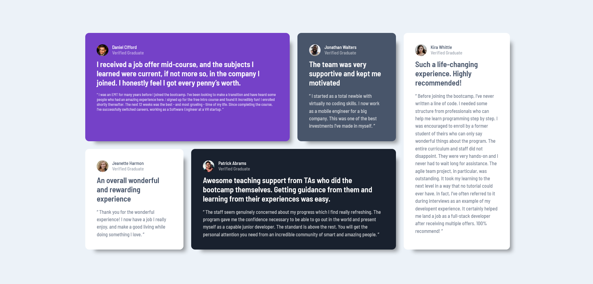

# Frontend Mentor - Testimonials grid section solution

This is a solution to the [Testimonials grid section challenge on Frontend Mentor](https://www.frontendmentor.io/challenges/testimonials-grid-section-Nnw6J7Un7). 

## Table of contents

- [Overview](#overview)
  - [The challenge](#the-challenge)
  - [Screenshot](#screenshot)
  - [Links](#links)
- [My process](#my-process)
  - [Built with](#built-with)
  - [What I learned](#what-i-learned)
  - [Useful resources](#useful-resources)
- [Author](#author)

## Overview

### The challenge

Users should be able to:

- View the optimal layout for the site depending on their device's screen size

### Screenshot

### Links

- Solution URL: [Click](https://www.frontendmentor.io/solutions/testimonials-css-grid-sass-aat3LRWFg3)
- Live Site URL: [Click](https://631b1ff06d37522d6b6b511e--splendid-mochi-a2de5a.netlify.app/)

## My process

### Built with
- VSCode
- Semantic HTML5 markup
- CSS custom properties
- Flexbox
- CSS Grid
- Mobile-first workflow

### What I learned

This was the first challenge were I trained my knowlede of **CSS Grid** and also I was able to use **SASS preprocessor**. I was a bit challenge for me but I am happy with the final result

### Useful resources

- [CSS Tricks](https://css-tricks.com/snippets/css/complete-guide-grid/) - This helped me understand CSS Grid more
- [Box-shadow generator](https://html-css-js.com/css/generator/box-shadow/) - This helped me with creating box-shadow for the testimonials

## Author

- Website - [J.Walczak](https://github.com/jwalczak94)
- Frontend Mentor - [@jwalczak94](https://www.frontendmentor.io/profile/jwalczak94)

